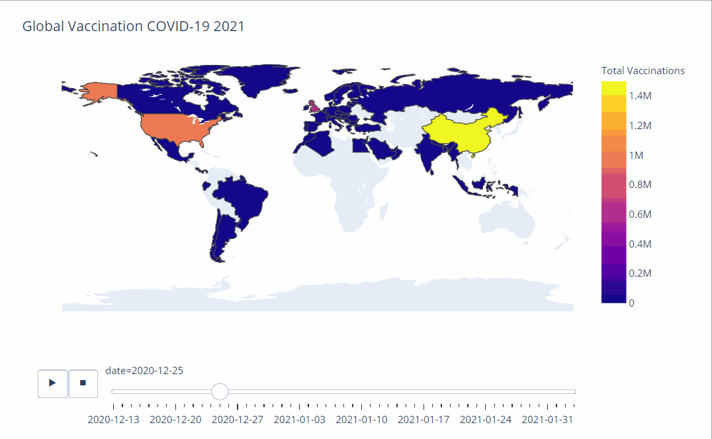

# Chart para visualização de dados de vacinação de COVID

Foi utilizada a biblioteca [Plotly](https://plotly.com/) para a visualização da evolução do número total de vacinas aplicadas por dia no mundo

Os dados foram retirados do repositório [Our World in Data](https://github.com/owid/covid-19-data/tree/master/public/data/vaccinations) 

---

Requisitos:
- pandas 
- plotly.express
